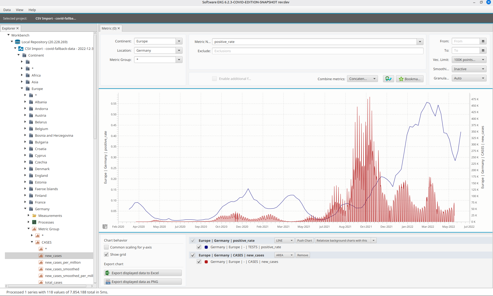
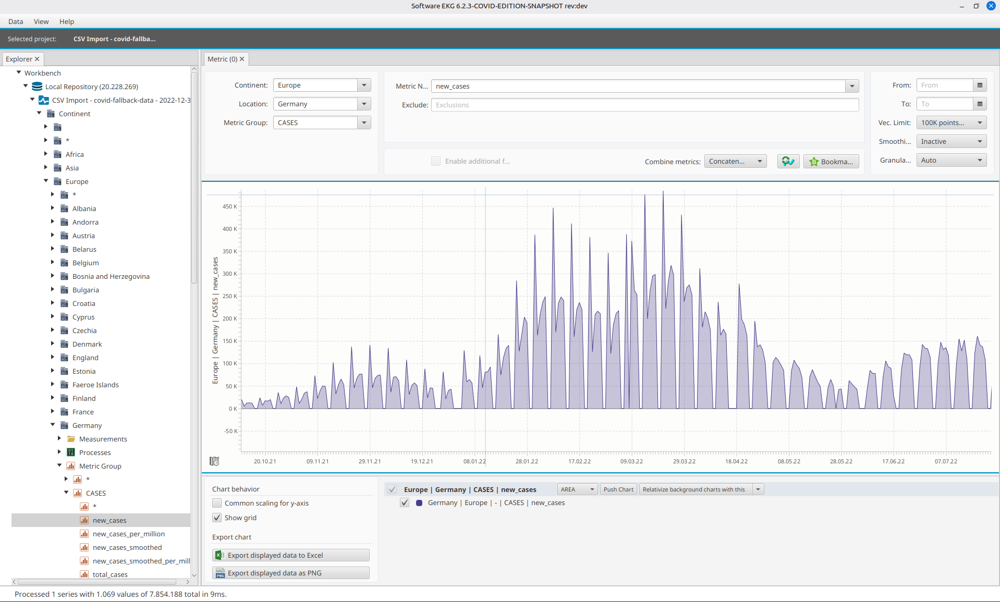

# Software ECG COVID-19 Edition - Application Guide

The **Software ECG (EKG)** is a powerful time series analysis and visualization tool. This COVID-19 Edition allows you to explore and analyze COVID-19 pandemic data from around the world.

## Features Overview

### 1. Visualizing New COVID-19 Cases by Country

The application allows you to view new COVID-19 cases for individual countries. Below is an example showing the new cases trend for Germany:

---

### 2. Comparing Countries

You can compare COVID-19 data across multiple countries simultaneously. This is useful for understanding how different regions were affected by the pandemic.

---

### 3. Regional Analysis - Europe

The application supports regional views, allowing you to analyze data for entire continents or regions. Here is an example of new COVID-19 cases across Europe:

---

### 4. Multi-Metric Analysis

You can overlay multiple metrics to gain deeper insights. For example, comparing new cases with new deaths helps understand the severity and fatality trends:

---

### 5. Combining Different Data Series

The tool allows you to combine different data series in a single view. Here, new cases are shown alongside total cumulative cases:

---

### 6. Analyzing Positive Test Rates

Beyond raw case numbers, you can also analyze derived metrics like the positive test rate, which indicates the percentage of COVID-19 tests that came back positive:

---

### 7. Zoom and Detailed Analysis

The application provides zoom functionality to focus on specific time periods for detailed analysis. This is particularly useful for examining waves or specific outbreak periods:

---

## Summary

The Software ECG COVID-19 Edition provides:

- **Time Series Visualization**: Display COVID-19 data over time with interactive charts
- **Multi-Country Comparison**: Compare pandemic trends across different countries
- **Regional Views**: Analyze data at the continental or regional level
- **Multi-Metric Overlay**: Combine different metrics (cases, deaths, rates) in a single view
- **Zoom & Pan**: Focus on specific time periods for detailed analysis
- **High Performance**: Handle large datasets with billions of data points efficiently

For installation and build instructions, please refer to the main [README.md](../README.md).
